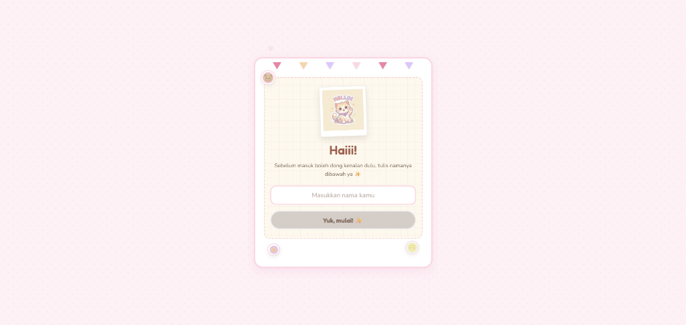

# 🌸 Soft Pastel Memory Book — Cute Interactive Birthday Web App 🎂

<p align="center">
  
</p>

Website ulang tahun interaktif berdesain *soft pastel* estetik yang dirancang khusus untuk merayakan hari spesial orang terdekat Anda. Proyek ini berjalan di atas React + Vite dengan berbagai gimmick multimedia menarik seperti tiup lilin menggunakan mic, chat WhatsApp tiruan yang lucu, album foto scrapbook digital yang bisa dibalik halamannya, serta digital photobooth webcam!

---

## 🧸 Maskot Karakter Lucu (Cute Mascots)
Perjalanan pengguna di dalam aplikasi ini ditemani oleh tiga karakter maskot imut beresolusi tinggi bergaya *nano banana* pastel:
- **Boni si Beruang 🐻** (menggunakan avatar `boni_bear.png`): Karakter beruang pastel hangat yang menyampaikan pesan apresiasi tulus.
- **Kiko si Kucing 🐱** (menggunakan avatar `kiko_cat.png`): Kucing asisten gembil yang setia mendampingi di pojok layar (mulai halaman Scrapbook) serta memandu tajuk mockup chat WhatsApp.
- **Lili si Bunga 🌸** (menggunakan avatar `lili_flower.png`): Karakter bunga sakral merah muda yang membawakan doa dan harapan baik mekar untuk masa depan.

---

## ✨ Fitur-Fitur Utama (Key Features)

### 1. 🕯️ Tiup Lilin Interaktif (Interactive Candle Blow)
- **Sensor Tiupan Suara**: Menggunakan **Web Audio API** untuk mendeteksi tiupan angin dari mikrofon perangkat pengguna secara langsung (*real-time*).
- **Efek Meriah**: Ketika kelima lilin kue padam ditiup, layar akan berguncang halus (*screen shake*), membunyikan melodi lonceng chime sintetis, dan menyemburkan partikel confetti meriah multi-gelombang secara bergantian.
- **Tombol Manual**: Jika pengguna tidak memberikan akses izin mic atau peranti tidak mendukung mic, tersedia tombol alternatif **"Tiup manual 🎂"** agar alur tetap dapat berlanjut secara mulus.

### 2. 💬 Gimmick Obrolan WhatsApp (WhatsApp Chat Mockup)
- Tampilan tiruan ruang obrolan bergaya WhatsApp bernuansa pastel modern dengan avatar profil **Kiko si Kucing**.
- Gelembung obrolan meluncur naik bertahap dengan efek suara notifikasi centang masuk (`soundeffect.mp3`).
- Menampilkan animasi mengetik (*typing indicator* tiga titik melayang) saat pesan sedang dipersiapkan.
- Diakhiri dengan tombol aksi *"Yuk, Upload Foto! 📷"* untuk mengunggah memori foto.

### 3. 📖 Album Polaroid 12 Halaman (Scrapbook Book)
- Album kenangan interaktif berbasis efek membalik halaman kertas nyata memanfaatkan pustaka `react-pageflip`.
- Setiap foto memori yang diunggah diposisikan pada bingkai foto polaroid besar dengan orientasi sedikit berputar estetik dan hiasan selotip pastel.
- **Playlist Musik Berurutan**: Lagu latar belakang `lagu1.mp3` dan `lagu2.mp3` berputar bergantian secara otomatis (*loop sequence*).
- **Transisi Fade-In**: Di awal pemutaran musik saat album dibuka, volume suara lagu memudar naik secara perlahan dari `0` ke target volume nyaman (`0.5`) dalam waktu 1.5 detik agar tidak mengejutkan pembaca.
- Halaman akhir Scrapbook menampilkan gambar kelinci ulang tahun kustom yang imut (`birthday_bunny.jpg`).

### 4. 📸 Bilik Foto Digital (Digital Photobooth Webcam)
- Integrasi langsung dengan kamera depan perangkat (*webcam*) menggunakan API browser `getUserMedia` pada halaman penutup.
- Tombol **"Ambil Foto 📸"** membekukan (*freeze frame*) kamera ke dalam bingkai polaroid instan—sangat pas untuk di-screenshot dan dibagikan.
- **Fallback**: Jika kamera tidak diizinkan atau tidak tersedia, sistem otomatis memunculkan polaroid ilustrasi melambaikan tangan yang imut secara anggun.

### 5. 🎧 Notifikasi Penyesuaian Volume
- Sebelum dialihkan masuk ke halaman Scrapbook, sebuah modal peringatan premium (`showVolumeModal`) dipasang menggunakan **React Portal** di atas `document.body` untuk menyarankan pengguna menyetel volume suara perangkat agar pas dan nyaman sebelum musik dimulai.

### 6. 🎁 Kejutan Penuh Layar (Surprise Modal Overlay)
- Tombol aksi akhir *"Tutup Mata & Hitung Sampai 3 💖"* yang membunyikan lonceng, menaburkan confetti, dan memunculkan modal kejutan penutup dengan pesan akhir paling manis untuk gebetan.
- Tombol navigasi balik *"Kembali ke Scrapbook 📖"* untuk membaca kembali lembar album foto tanpa me-reset data yang telah diunggah.

---

## 🛠️ Ketergantungan & Pustaka (Tech Stack)

- **Library Utama**: React (Hooks, Portals)
- **Build Tool**: Vite (Sangat cepat dan ringan)
- **Styling**: Vanilla CSS (Menggunakan variabel warna HSL kustom, tata letak Grid & Flexbox, serta transisi animasi halus)
- **Efek Partikel**: `canvas-confetti`
- **Animasi Kertas**: `react-pageflip`
- **Audio**: HTML5 Audio & Web Audio API (untuk sintesis melodi chime)

---

## 🚀 Cara Menjalankan Proyek Secara Lokal (Installation)

1. **Clone repositori** ini atau unduh folder proyek.
2. Pastikan Anda telah menginstal **Node.js** di komputer Anda.
3. Buka terminal di direktori proyek dan instal semua ketergantungan (dependencies):
   ```bash
   npm install
   ```
4. Jalankan server pengembangan lokal:
   ```bash
   npm run dev
   ```
5. Buka alamat `http://localhost:5173` (atau port yang tertera) di browser Anda.

---

## ☁️ Cara Deploy ke Internet Secara Gratis

### Pilihan 1: Netlify Drag & Drop (Paling Instan)
1. Lakukan kompilasi produksi di terminal:
   ```bash
   npm run build
   ```
2. Buka folder proyek Anda, temukan folder baru bernama `dist`.
3. Buka situs [Netlify Drop](https://app.netlify.com/drop) di browser.
4. Seret (drag) folder `dist` tersebut dan letakkan ke area unggah Netlify. Website Anda langsung online dalam hitungan detik!

### Pilihan 2: Vercel CLI (Lewat Command Line)
1. Instal Vercel secara global: `npm install -g vercel`.
2. Jalankan perintah `vercel` di dalam folder proyek Anda.
3. Masuk dengan akun Anda, tekan Enter untuk menyetujui opsi default, dan proyek akan langsung terunggah secara otomatis.
